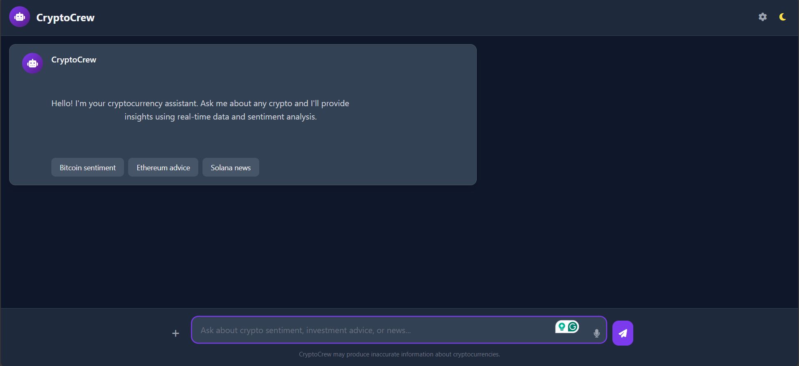

# CryptoCrew

CryptoCrew is a multi-agent chatbot for cryptocurrency insights, powered by CrewAI and Groq LLMs. It provides real-time market data, sentiment analysis, and personalized responses about various cryptocurrencies.

## How It Works
- The backend uses CrewAI agents for intent classification, market analysis, memory management, and response generation.
- ChromaDB stores conversation history for context-aware replies.
- The frontend (Flask) serves a chat UI and connects to the backend via REST API.

## APIs Used
- Groq LLMs (via langchain-groq)
- ChromaDB (for memory)
- CoinGecko (for price data)
- FastAPI (backend)
- Flask (frontend)

## Main Endpoints
- `POST /chat` — Chat with the bot
- `GET /health` — Service health check

## Quick Start
1. Add your Groq API key to `.env`.
2. Run `docker-compose up -d` or use `python start.py` for local development.
3. Access the app at http://localhost:3000

## License

This project is licensed under the MIT License.
